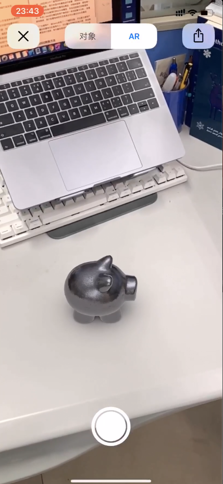

# ARProducts

 &nbsp &nbsp &nbsp &nbsp &nbsp &nbsp &nbsp &nbsp &nbsp

* 选择
* 投射 
* 旋转
* 缩放
* 移动
* 测距

Controller文件夹下：

* `ARQuickLookController.swift` → USDZ模型预览功能
* `ViewController.swift` → 项目主体：三个模式 `.none` `placeObject` `measure`
